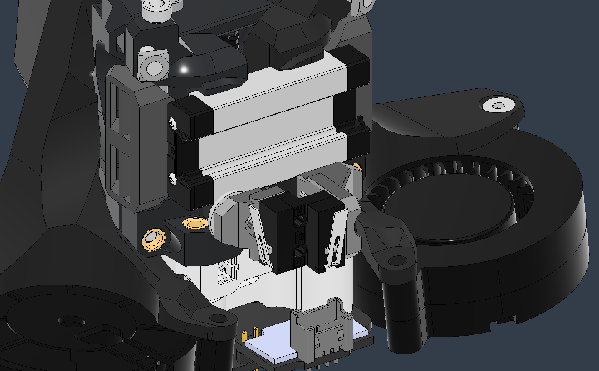

# ArcheStop XY

Long speech short: This adds endstops (X and Y) to your Archetype. That's it, bye!

... Okay a few more words. This is small printed piece that goes on the Rail Core screws that are at the bottom rear of the carriage; the ones with the M5 Washers. However you simply replace the FHCS with some longer BHCS or SHCS (I used 20mm ones). You can mount the switches with two M2x10mm screws.

Depending on your gatry the switches can trigger on the xy joints and/or the AB motor mounts. If not, I added some Trigger Blocks you can mount with one screw on the profiles (M3 for 1515 and M3/M5 for 2020).

### BOM

1-2x Omron (X and/or Y)
2x M3 18-10mm SHCS or BHCS
2x M2x10mm self tapping (per switch)
---
M3 or M5 + T-Nut for mounting the tigger block

### Pictures

  

   

