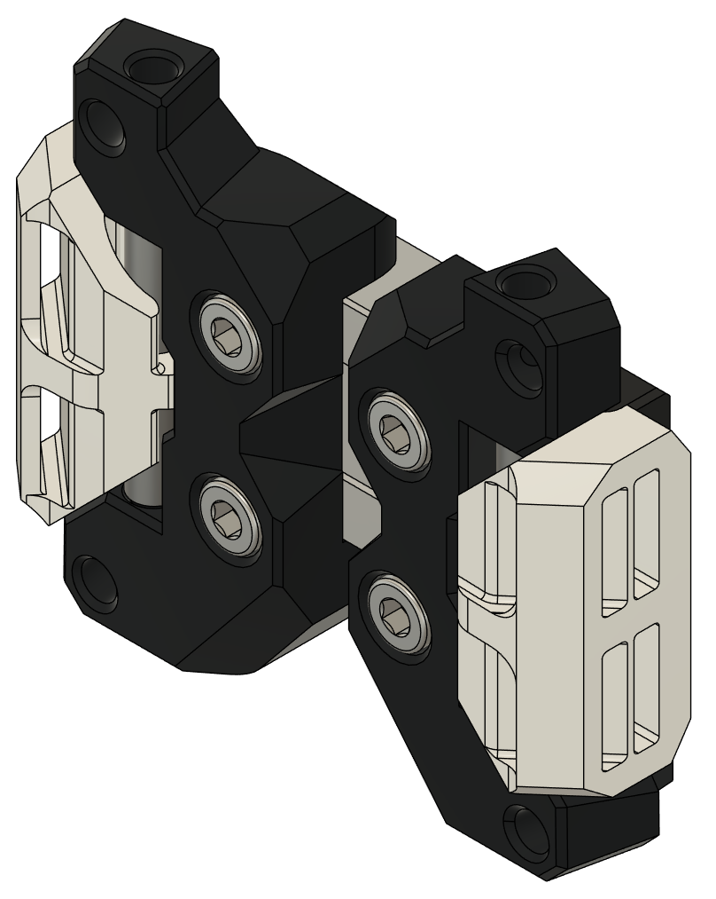

# Archetype for Ants
The MGN9H carriage and belt clips have been adjusted to fit Ant size printers!

Currently there are some users reporting issues of the belt clips not aligning properly under tension. Please report any of these such issues along with all relevant information (X rail type, printer type, any mods you're using) in the [#archetype_beta channel](https://discord.com/channels/1029426383614648421/1145450908575076482) and tag @mastur_mynd.

#BOM
| | Item Description | Qty | Notes |
| --- | --- | --- | --- |
| Printed Parts | | | |
| | mgn9_left.stl | 1 | |
| | mgn9_right.stl | 1 | |
| | [a]_belt_clamp_x2.stl | 2 | |
| Hardware | | | |
| | M3x6 SHCS | 4 | |
| | 3x45mm Pin | 2 | Screws or other similar hardware can be substituted |
| | 4x22.5mm Tube 0.4mm Wall | 2 | |
