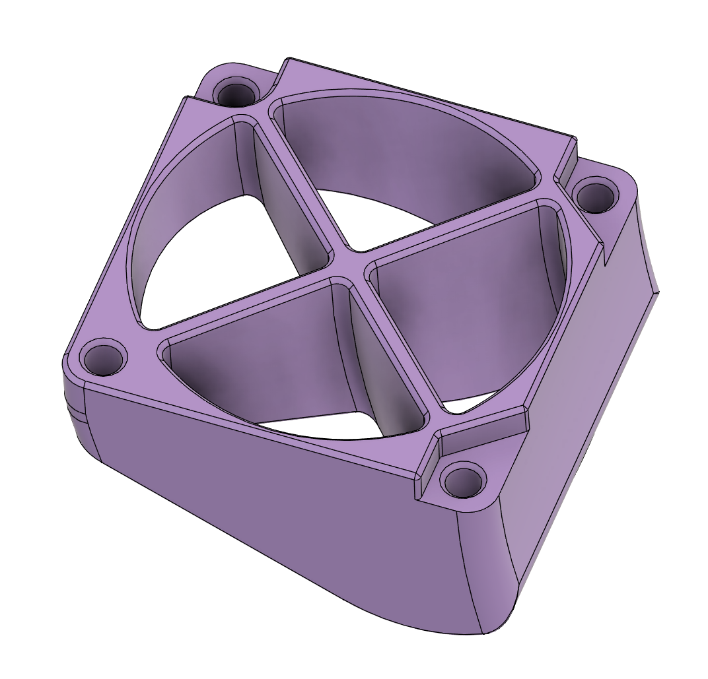

An alternative duct for atrocity. Much inspiration for the vane layout taken from cbon's axial ducts (though it's really simple...)

Please ping me if you print this and compare it to the duct from the main archetype repo. I have no idea if this is actually a better duct