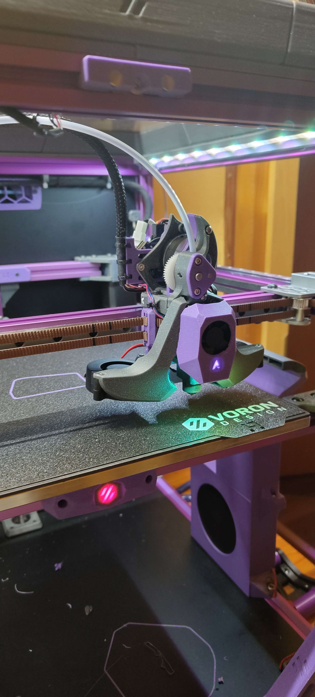
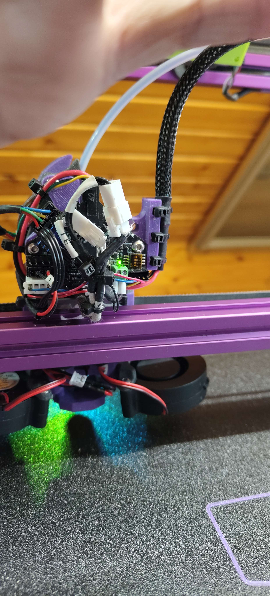

# EBB36 "Shorty" Mount modified to work with Sharketype
### original mount by neon.blue

a modified version of [XOL EBB36 Shorty mount](https://github.com/Armchair-Heavy-Industries/AE-Usermods/tree/main/files/Xol-Toolhead/EBB36_Shorty_Mount)  suitable for use with Sharketype

same Features as the original:

### Features
 * Shorter strain relief height
 * Triple zip tie mount
 * Molex connector isn't subject to head movement as much

 

its a hack job done in slicer and tinkercad, so excuse any errors in the mesh etc, but it prints fine and looks fine for me when printed with 0.2mm layerheight and PIF settings
 

## Credits

This is an edit of the [XOL EBB36 Shorty mount](https://github.com/Armchair-Heavy-Industries/AE-Usermods/tree/main/files/Xol-Toolhead/EBB36_Shorty_Mount).
