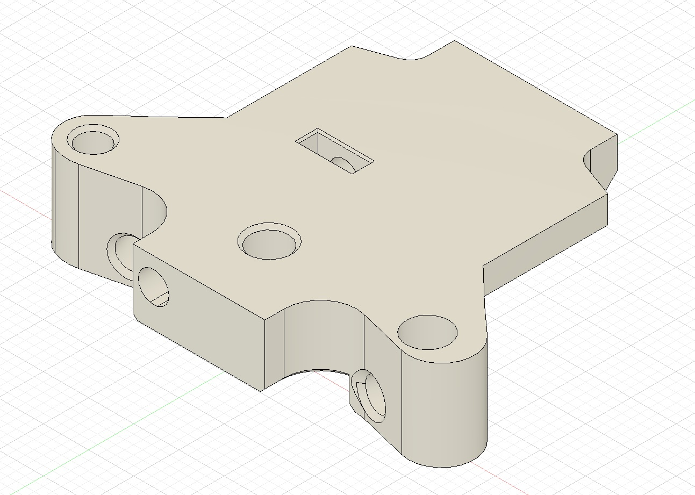
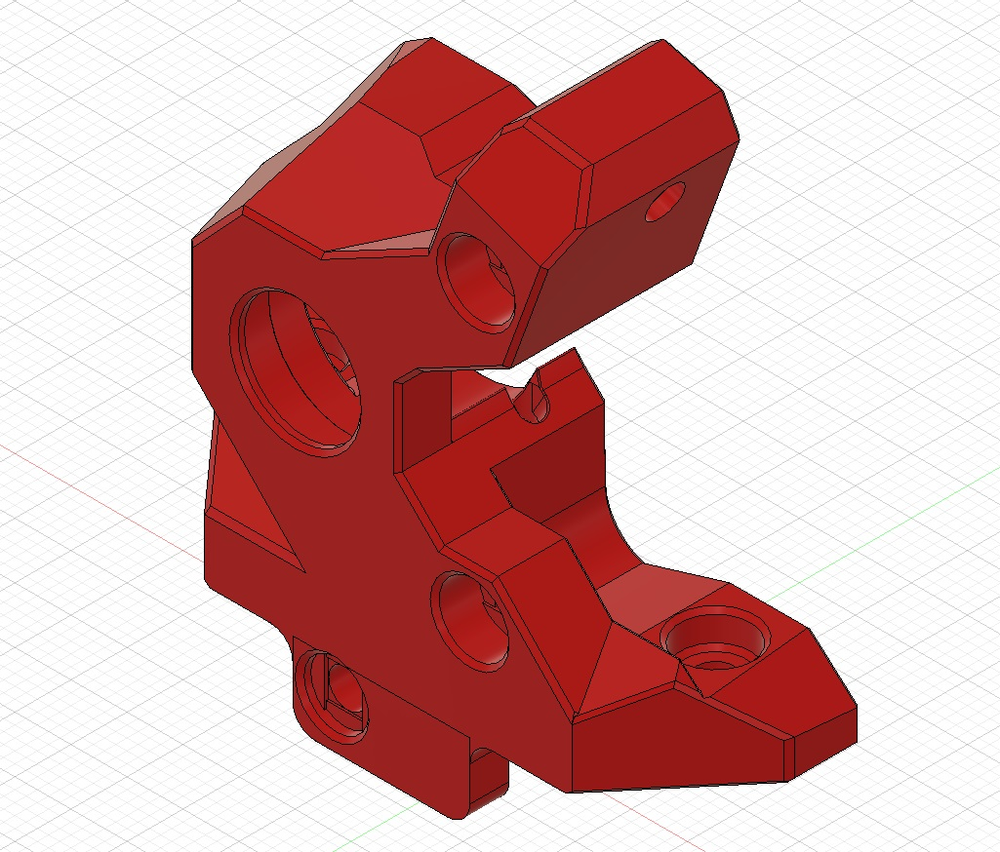

# Galileo 2 Wristwatch extruder block for Experimental Core
[axg20202]

A fairly rough and ready flat extruder block to mount the Galileo 2 Wristwatch extruder (or similar) to the Experimental Core (see Experimental Git branch). This is a quick solution pending the release of updated Archetype CAD. Full compatibility with all beta Archetypes is unknown, but this is confirmed to work with Experimental Mjolnir ducts.  

A tweaked version of the G2 wristwatch front is included - the only change here is the position of the additional front securing tab and screw hole. 

Thanks to tetsu97 for creating the G2WW https://github.com/tetsu97/WristWatch-G2-Extruder

### BOM

```
4 x M3 heatset inserts
1 x thin M3 square nut (optional)

```

### Pictures


