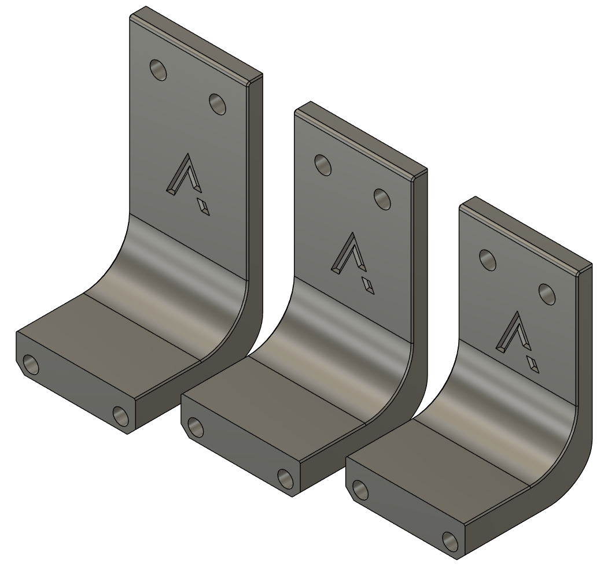

# Klicky Dock Arms Specifically for Archetype
The suggestion for klicky with Archetype had always been to use the adjustable dock. In my experience, this works well enough, but tends to become loose and floppy over time.

Taking measurements from a stock Voron VT/V2 gantry, I purpose built dock arms to both reduce needed hardware and provide a more sturdy mounting solution.

#BOM
| | Item Description | Qty | Notes |
| --- | --- | --- | --- |
| Printed Parts | | | |
| | klicky_archetype_xxx.stl | 1 | Choose the appropriate file for your toolhead length |
| | Klicky probe dock | 1 | [Klicky / Unklicky](https://github.com/jlas1/Klicky-Probe/tree/main/Probes) / [PCB Klicky](https://github.com/tanaes/whopping_Voron_mods/blob/main/pcb_klicky/STLs/dock-front_insert.stl) |
| Hardware | | | |
| | M3x16 or M3x20 SHCS | 2 | |
| | M3 Heatset Insert | 2 | |
| | M5x10 BHCS | 2 | |
| | 2020 M5 T-Nut | 2 | |
| | 3x6mm Round Magnet | 1 | |
