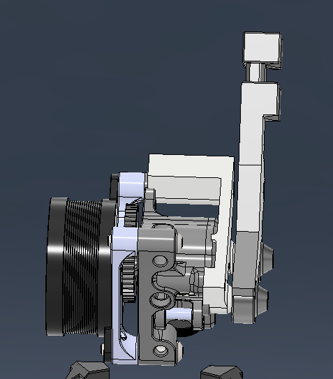
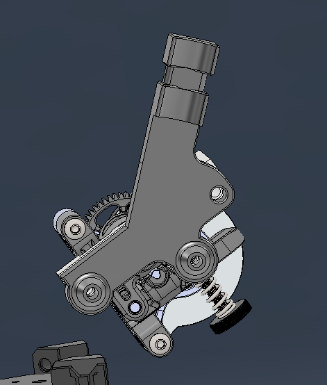

# Archetype Strain Relief for Microsherpa/Carabiner
### By str1pes

## Overview
This project provides a quick and easy strain relief solution designed to fit onto the existing Microsherpa/Carabiner mount. The strain relief utilizes the two bumps on the mount for indexing, ensuring a secure and reliable fit.

## Bill of Materials (BOM)
- Screws (longer than the original ones to accommodate the added width of the strain relief)

## Installation Instructions
1. Remove the original screws from the Microsherpa/Carabiner mount.
2. Place the strain relief onto the mount, aligning it with the two bumps for proper indexing.
3. Tighten the longer screws with a few ugga duggas to ensure the strain relief is firmly attached.

## Images
For a visual reference, please refer to the images below:

### Front View

### Side View

