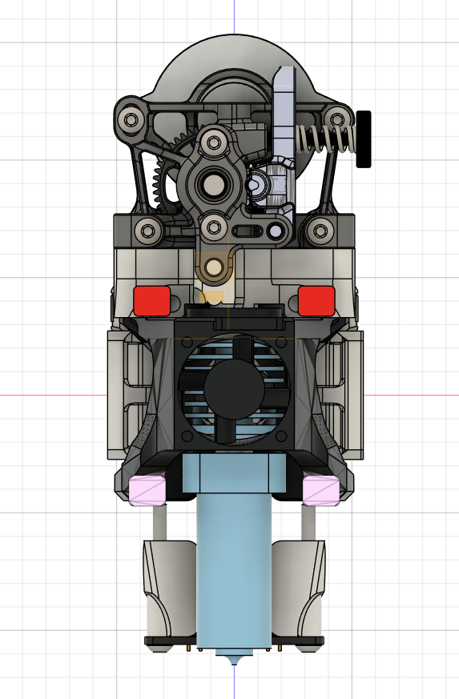

# Peopoly Lancer Melt Zone Long mount

Archetype mount for the Peopoly Lancer Melt Zone Long. 

Length wise, matches a Chube Air, so use that as a reference when choosing cooling/probe mounts. I'm using it with Mjolnir.

The hot end comes with an integral tube, making it incompatible with Breakneck. Sorry! A flat top Sherpa mount adapted to match the length of this tube is included. No PTFE needed.


Long molten pool:
-
Melt pool length：45.0mm

Flow rate：60mm3/s

Comes with a 0.6mm harden steel nozzle

### BOM

```
4x M3x8-10 BHCS for mounting the hot end
3x M3 square nut for the extruder mount
```

### Pictures

 
