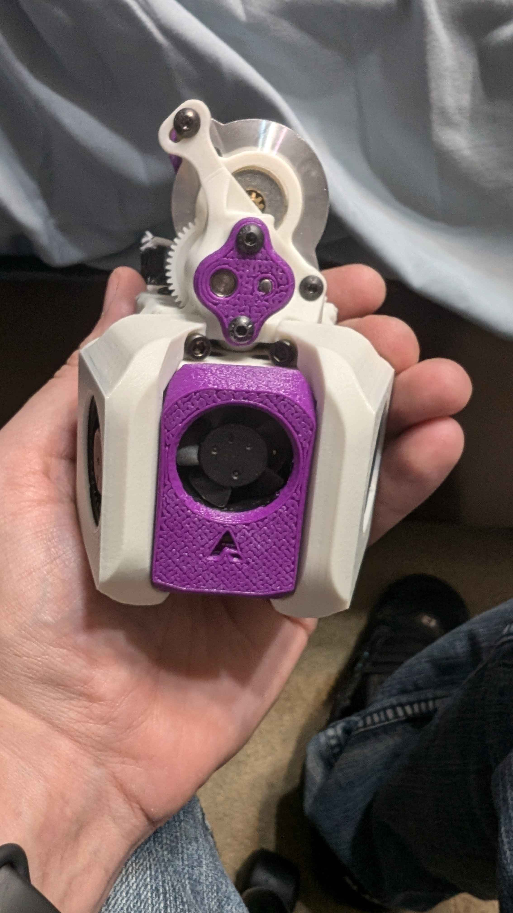

# Snakebite
Stemming from the sleek package Takti introduced as the Shepherd extruder for Archetype, Snakebite lowers the extruder drivetrain by 1.5mm. The secondary filament drive gear has been replaced by a 683 / MR73 bearing in an attempt to combat the well known [Issue 6](https://github.com/VoronDesign/Voron-Afterburner/issues/6), prevelant on most direct feed extruders.

#BOM
| | Item Description | Qty | Notes |
| --- | --- | --- | --- |
| Printed Parts | | | |
| | center_plate.stl | 1 | |
| | motor_plate.stl | 1 | |
| | rear_brace.stl | 1 | |
| | [a]_front_cap.stl | 1 | |
| | [a]_strain_relief.stl | 1 | Optional |
| Hardware | | | |
| | BMG Gear Set | 1 | |
| | Nema14 Stepper Motor | 1 | |
| | 3x20mm Pin | 1 | If not included in BMG set |
| | 683 / MR73 | 1 | |
| | M3x16 BHCS | 2 | |
| | M3x10 BHCS | 3 | Two are optional, but I suggest 5 ;) |
| | M3x8 BHCS | 2 | |
| | M3 Square Nut | 2 | |
| | M3 Heatset Insert | 5 | Two are optional |
| | M3x20 Threaded Standoff | 2 | Optional
