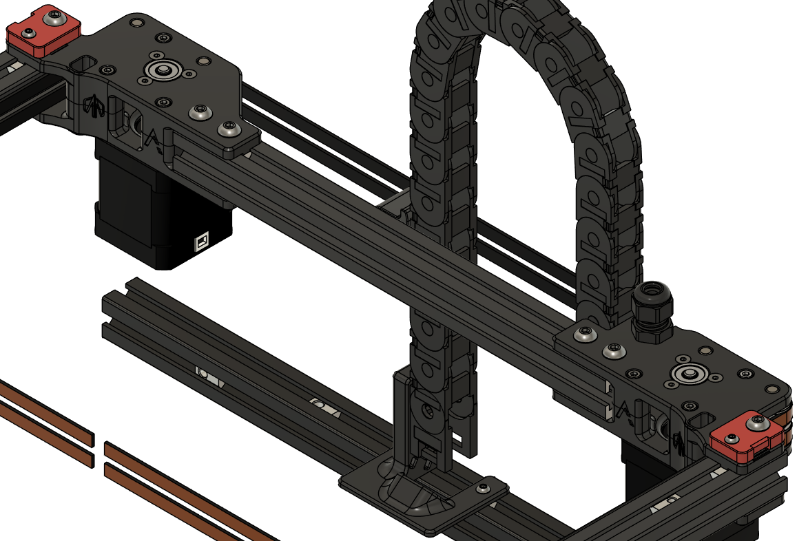

# V2 Z Chain Relocation
The Z chain on a stock Voron 2 will cause issues for some of the extruders for Archetype, namely the breakneck blocks, Escapement and Kyro. In order to make room for these extruders the Z chain and rear gantry extrusion have been swapped.

In order to further compatability, the top outer mounting points have been adjusted to make room for top mounted Y rails.

Additionally, in place of the typical passthrough, an M12x1.5 thread has been modeled into the top half of the A drive frame for cable glands.

#BOM
| | Item Description | Qty | Notes |
| --- | --- | --- | --- |
| Printed Parts | | | |
| | a_drive_frame_lower.stl | 1 | |
| | a_drive_frame_upper.stl | 1 | |
| | b_drive_frame_lower.stl | 1 | |
| | b_drive_frame_upper.stl | 1 | |
| | z_cable_anchor.stl | 1 | |
| | [a]_z_belt_clamp_upper_rear_left.stl | 1 | |
| | [a]_z_belt_clamp_upper_rear_right.stl | 1 | |
| | [a]_z_chain_retainer_bracket_x2.stl | 2 | Found on the official [Voron 2 Repo](https://github.com/VoronDesign/Voron-2/blob/Voron2.4/STLs/Gantry/AB_Drive_Units/%5Ba%5D_z_chain_retainer_bracket_x2.stl)
| Hardware | | | |
| | M12x1.5 Cable Gland | 1 | Optional |
| | Nema17 Stepper Motor | 2 | |
| | GT2 20T 6mm Drive Gear | 2 | |
| | F695-2RS Bearing | 14 | Two of these are optional for double shear drive shafts. |
| | M3x6 FHCS | 6 | Optional for double shear drive shafts. |
| | M3x6 or M3x8 BHCS | 2 | |
| | M3x16 BHCS | 4 | |
| | M3x30 SHCS | 6 | |
| | 2020 M3 T-nut | 6 | |
| | M5x10 BHCS | 8 | |
| | M5x16 BHCS | 2 | |
| | M5x40 SHCS | 2 | |
| | 5x10x1mm Shim | 12 | |
| | 2020 M5 T-nut | 10 | | 
| | 5x28mm Pin | 2 | |
| | 5x30mm Pin | 2 | |
