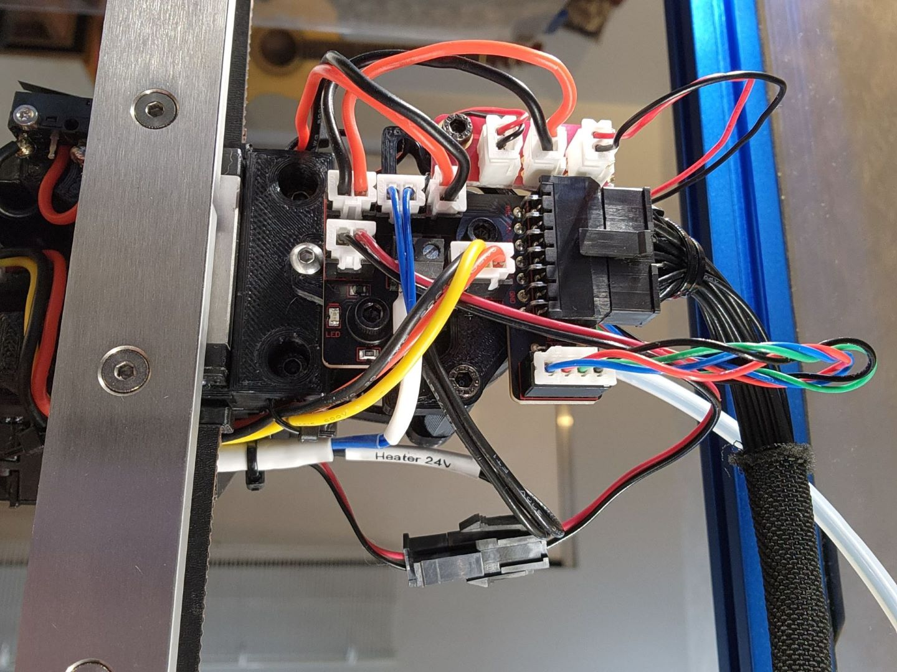

# Afterburner_Toolhead_PCB_Mount
### By MegaMooks

This mod allows attaching the [hartk1213 Afterburner Toolhead PCB](https://github.com/VoronDesign/Voron-Hardware/tree/master/Afterburner_Toolhead_PCB) commonly included in LDO Voron kits to the XOL Toolhead using the third stability screw located on the back of the carriage. It is designed for the Sherpa Mini, though it may work on other extruders.

It is inspired by [KayosMaker's CANboard Mounts](https://github.com/Armchair-Engineering/Mantis-Xol/tree/main/STL/Hartk%20PCB%20Mount) and the [original Hartk PCB mount](https://github.com/Armchair-Engineering/Mantis-Xol/tree/main/STL/Hartk%20PCB%20Mount).

You may want to build a 1->2 fan splitter PCB or splice the two 4010 fans together.

## BOM

* Two m3x5x4 heatset inserts
* Two m3x8 SHCS
* Two nylon washers

## Assembly

Sink the two heatset inserts from the back into the two larger holes in the middle.

Attach the Toolhead PCB to the plate using the m3x8 SHCS and nylon washers.

Attach the plate to the brass standoffs in the extruder using two more SHCS according to the Xol-Toolhead instructions.

