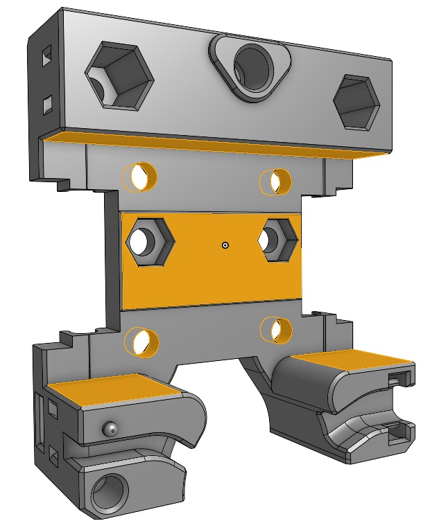
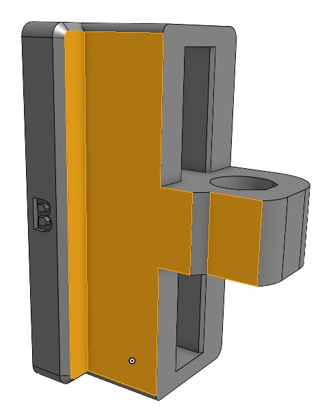

# Xol Carriage for CPC MR 12ML rails

These rails are not the standard MGN12H size. The carriage is longer and narrower and the top interferes with the stock carriage.

> [!NOTE]
> This mod is based on Xol CAD released 2023-09-15.

> [!WARNING]
> This was made based on CPC CAD files and have not been printed and tested yet. I don't see why it would not work, but be aware of this if you try it out.

## Carriage modifications

### Adjusted hole spacing

The stock carriage has 19.86mm hole spacing which seems like a carry over from Tap. This was adjusted to 20mm.

### Carriage clearances

The CPC carriage is narrower than MGN12H so the Xol carriage was adjusted to be more snug. According to the CPC carriage CAD there was some interference where the carriages mounting surface is so the Xol carriage face was moved back some.

## Belt clip modifications

### CPC carriage clearance

To make room for the longer CPC carriage the belt clip received a cutout on the back side. Since the CPC rail endcaps are quite a lot slimmer than MGN12H the clip was thiccened slightly to rest agaist them and give more meat to the cutout part. There was also a slight clearance issue with the end of the clip with the pin so it was cut out as well.
