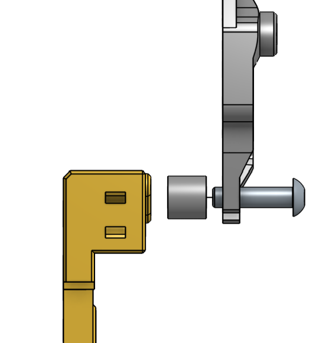

# EBB36 G2SA Mount

> [!NOTE]
> This mod is based on Xol CAD released 2023-09-15.

## Assembly instructions

Ensure that the tab of the mount slides in between the spacer and the end of the screw when mounting. Use a M3x12 screw (BHCS/SHCS).

## Changelog

*2023-10-20* Realigned the strain relief as the original model was based on v1.0 of EBB36. Also removed the button cutouts since newer boards to not have them underneath the USB connector. Made the spacer ID slightly smaller to better stay in place while mounting.

## Credits

This is an edit of the EBB36 Orbiter mount with strain relief by Kayos Maker found .