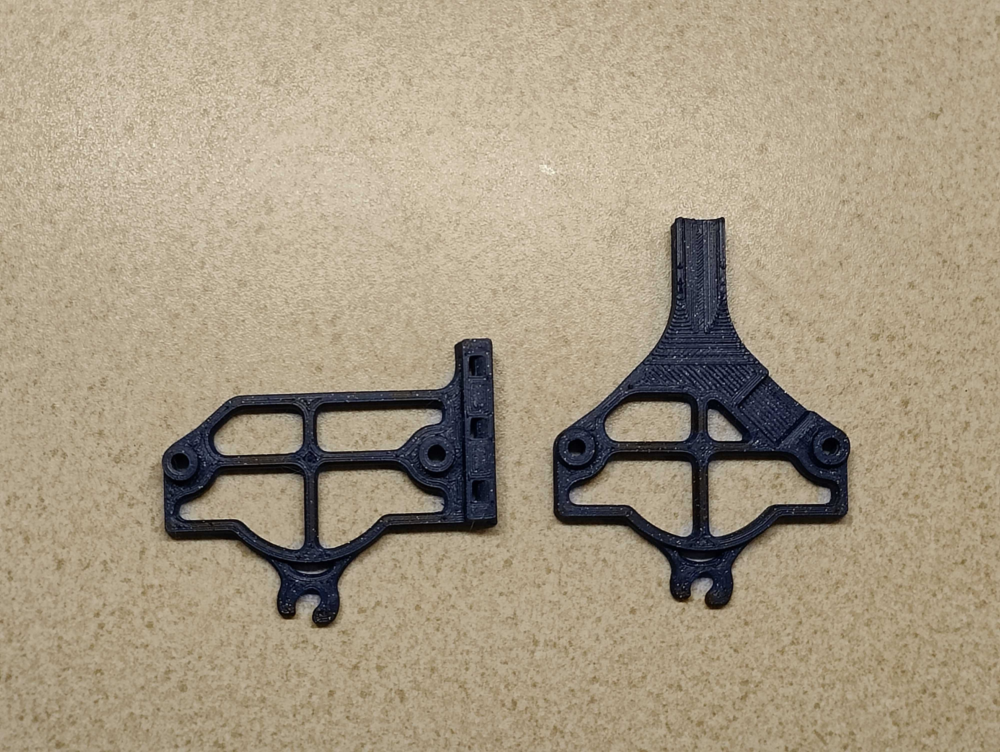

# EBB36 Sherpa "Shorty" Mount
### by neon.blue

This alternate mount shortens the vertical height needed, which is ideal for a Voron Trident or similar printer without much space above the toolhead. This ends up decreasing the mount height by about 20mm, resulting in about 75mm from the upper panel to the top of the strain relief on a stock build Trident.

### Shorty mount versus official mount

## Credits

This is an edit of the [official EBB36 Sherpa mini mount](https://github.com/Armchair-Engineering/Xol-Toolhead/blob/main/STL/EBB%20Mounts/EBB36%20Mount%20-%20Sherpa-Mini%20%5Bstrain%20relief%5D.stl).
