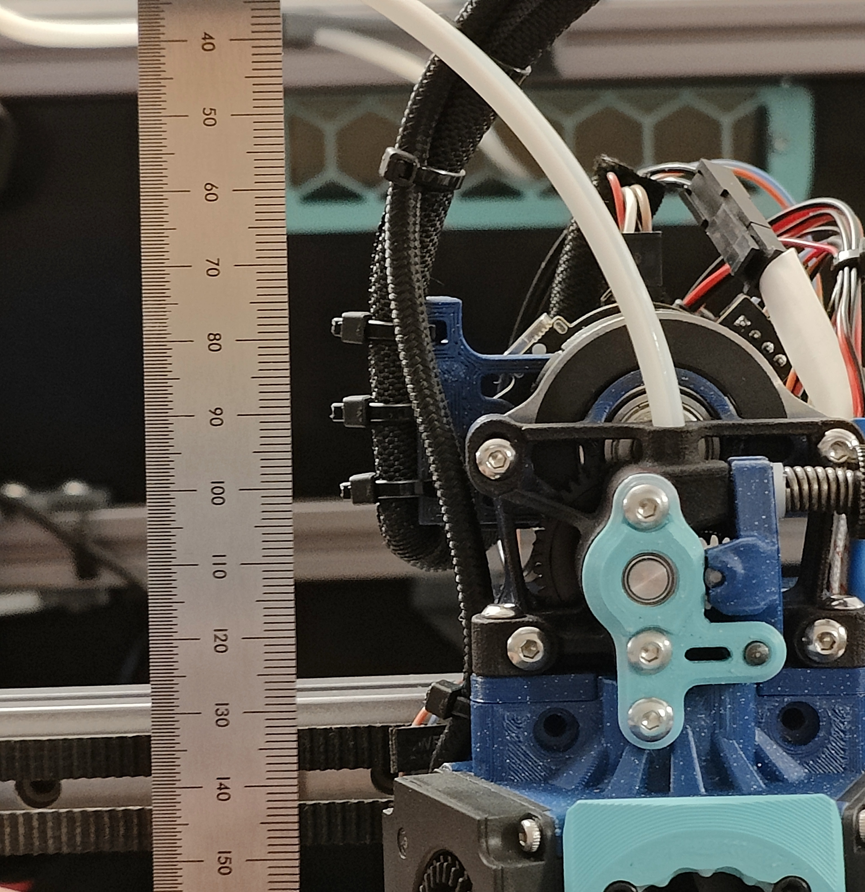

# EBB36 Sherpa "Shorty" Mount
### by neon.blue

This alternate mount shortens the vertical height needed, which is ideal for a Voron Trident or similar printer without much space above the toolhead.

### Shorty mount versus official mount

## Credits

This is an edit of the official EBB36 Sherpa mini mount [here](https://github.com/Armchair-Engineering/Xol-Toolhead/blob/main/STL/EBB%20Mounts/EBB36%20Mount%20-%20Sherpa-Mini.stl).