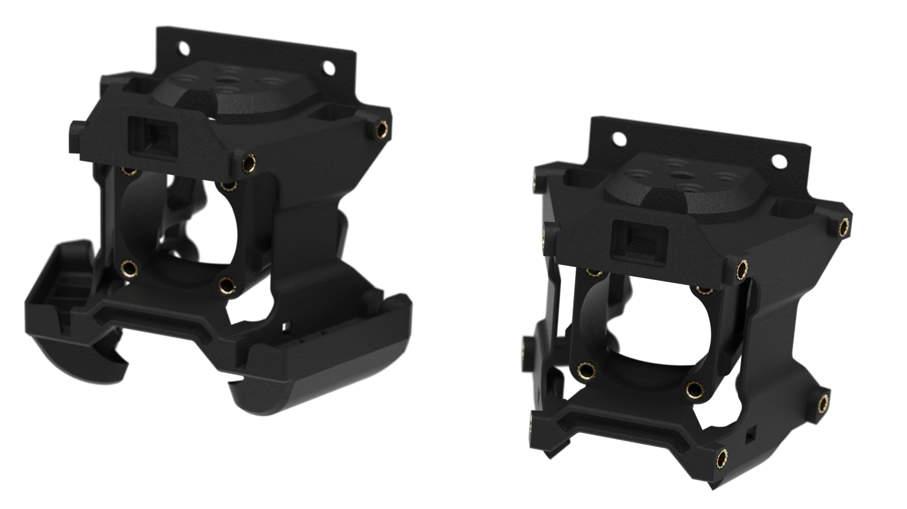

# Hotend Mounts with Heatset Inserts for Xol Toolhead (15/06/2024)
### By [DW Tas]
If you can't bring yourself to put screws into plastic, or you take your toolhead apart so much that you're wearing the plastic holes out... Then this is the mod for you!

Follow the build instructions at https://github.com/Armchair-Heavy-Industries/Xol-Toolhead/tree/pre-release/docs but inserat 8x (or 12x for XolPAP) M2.5 heatset inserts where the fan screws would go in.

Additional BOM items:

| Item | Qty 4010 blowers | Qty XolPAP |
|------|------------------|------------|
| M2.5 Heatset Inserts  OD 3.5mm, L 4mm| 8| 12|

    
This work is licensed under a
[Creative Commons Attribution-NonCommercial-ShareAlike 4.0 International License][cc-by-nc-sa].

[![CC BY-NC-SA 4.0][cc-by-nc-sa-image]][cc-by-nc-sa]

[cc-by-nc-sa]: http://creativecommons.org/licenses/by-nc-sa/4.0/
[cc-by-nc-sa-image]: https://licensebuttons.net/l/by-nc-sa/4.0/88x31.png
[cc-by-nc-sa-shield]: https://img.shields.io/badge/License-CC%20BY--NC--SA%204.0-lightgrey.svg
