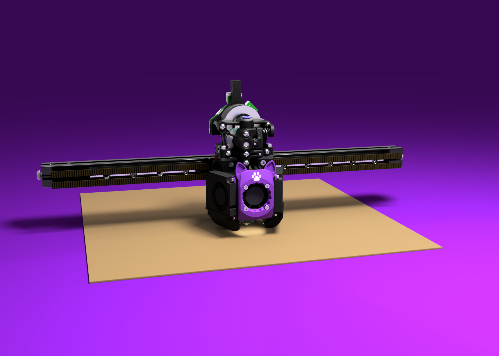

# MeowXol LED Faceplate

### By [Kimarru](https://github.com/Kimarru)

Original faceplate uses the [LED insert](https://github.com/Armchair-Engineering/Xol-Toolhead/blob/8738f04827ed52bf14f475c76bdd0ff187363ccf/STL/Faceplates/%5Bwhite%5D%20LED%20diffuser.stl) from before the 20230915 major update.

New faceplate has its own insert that will not work with the old versions of the MeowXol faceplate.

New faceplate and insert has not been tested on Xol.

Recommend printing the LED insert with arachne or a small nozzle for best results.

## Credit  
Armchair Engineering for Xol and faceplate model 

[Wissencat](https://www.printables.com/@Wissencat) for the cat ears model

[DW Tas](https://github.com/DW-Tas) for creating the wonderful render
