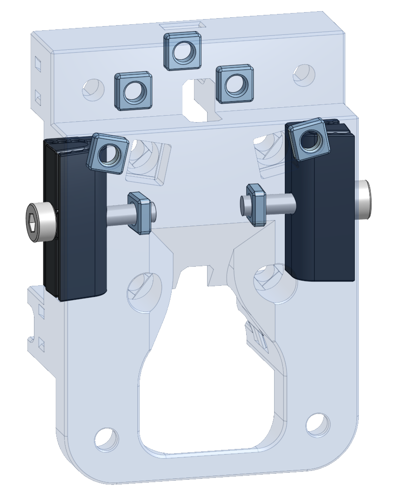

# Xol-Carriage with different belt system for Monolith Gantry

A bit of an experimental MGN12H carriage for Monolith. 

Wherever possible I've replaced hex nuts with DIN562 M3 square nuts.
The screws that go through the clips are M3x16. BHCS is probably best for lower profile, but SHCS is fine. 

These are the square nuts I used (M3): https://www.aliexpress.com/item/1005001612157787.html

### Print Settings
Must use 0.2mm layer height.  
Voron like settings will be fine. at least 1.5mm total perimiter thickness (4x 0.4mm wall or 3x 0.5mm wall) 5x top/bottom layers. 40% infill.

There is now a BETA 2 in the STLs folder.

`It has a new two-piece clip design that should be nicer on the belts. It also moves the toolhead forward 2mm to improve clearances around the X/Y joints.`

I have added some loops to hold the belts in place while you push the clip and belt into the side of the carriage and tighten the screws. Everything else is per normal Xol Carriage build. 

*The indents in the clips go to the back. 

**Please provide feedback.

