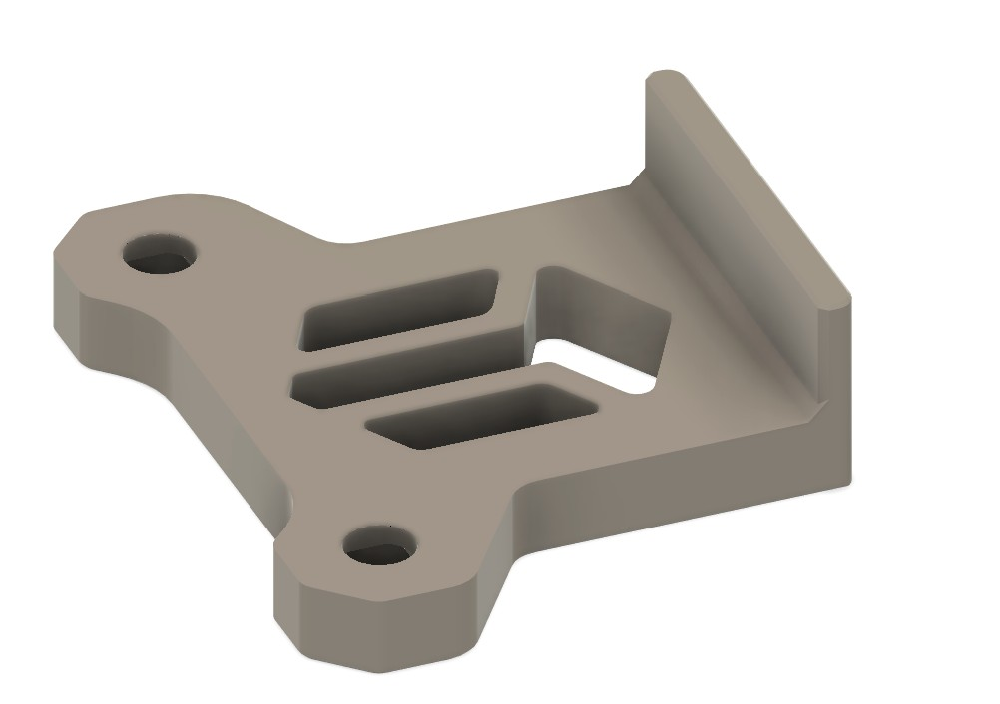
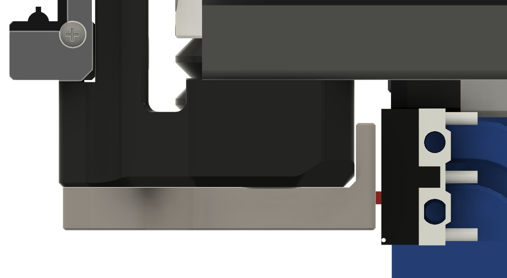

# Monolith X Endstop extender for Xol-Carriage - Shorter version (A4T)

> Based on the design of OlBamboozler

On A4T we don't need as much clearance as in original design.

You should expect to lose about 2mm in X travel compared to stock gantry.

## Preview

## Tolerance

The tolerance is **< 1mm**  so make sure all your wires are neatly secured on the other side.

## Multiple variations
| | | 
|-|-|
| With logo | Because it's fancy |
| Without logo | If your pin slightly protrudes at the bottom |
| Normal | -4.5mm compared to original design |
| Minus 4 | -4mm compared to original design |
| Minus 3.5 | -3.5mm compared to original design |

## Bom 
Same as original: 2x M3 Square nut 

## Modifications
- Reduced x width by 4.5mm
- Increased tolerance on chamfer between horizontal and vertical part
- Added extra version with removed logo to allow for small protrusion of the pin
