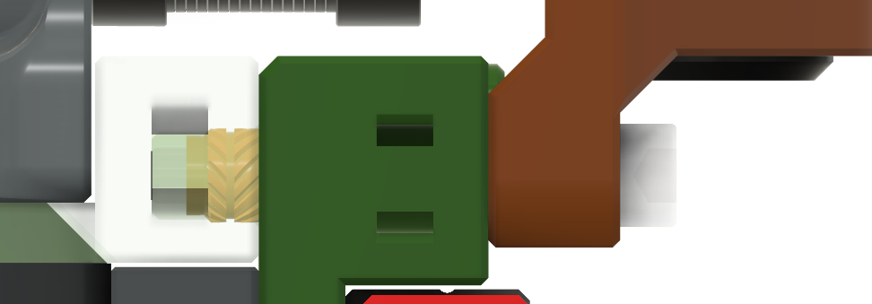
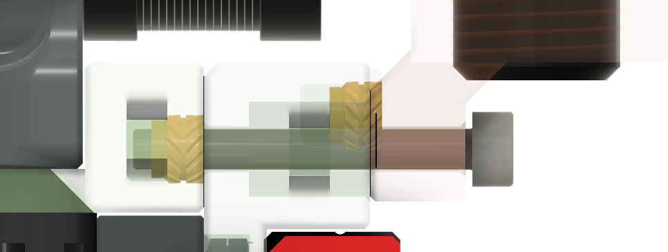
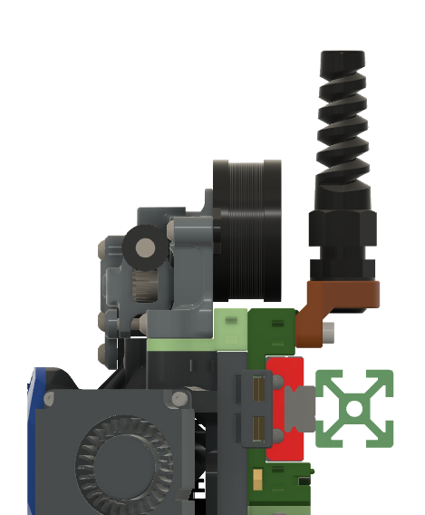

# Umbilical mounts for Orbiter 2 - PG7, PG9
### By [Stevan](https://github.com/stevan3d)

Idea of this mount is to allow using of standard wiring harness through umbilical.

## BOM
- Two M3x24 or M3x25 (probably is easier to get M3x25, in that case you can grind it by 0.5-1mm or use M3 washer).

#### M3x25 intersection:
/
#### M3x25 intersection with 0.5mm spacer:

> **_NOTE:_**  Current version is tested only with Orbiter 2.0 and simulated with Sherpa mini.

## Images

 

 

