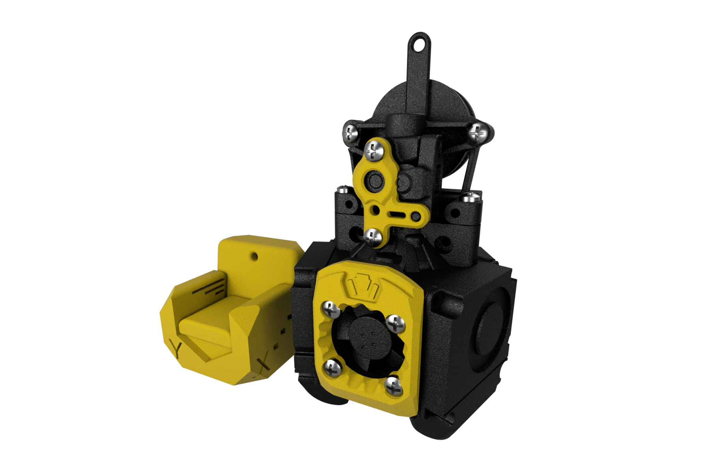
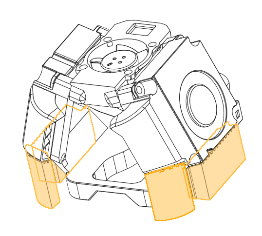
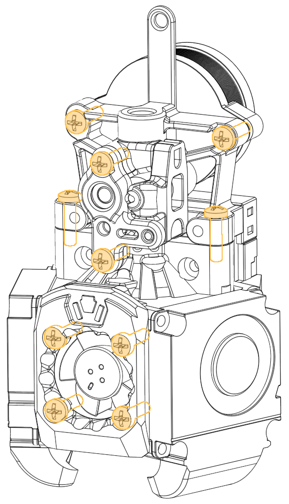

# Xol-Toolhead Tree Ornament

So you built a stock ornament on the [first day of Voronmas](https://github.com/VoronDesign/Voron-Extras/tree/main/Ornaments/2023/), now it's time to up your game and get some mods on your tree.

| Step                       | Notes                                        |
| -------------------------- | --------------------------------------------- |
| BOM                        | Printed parts   10x M2 Self Tapping Screw |
| Remove Supports            |                   |
| Install fiddly M2 hardware |                 |
